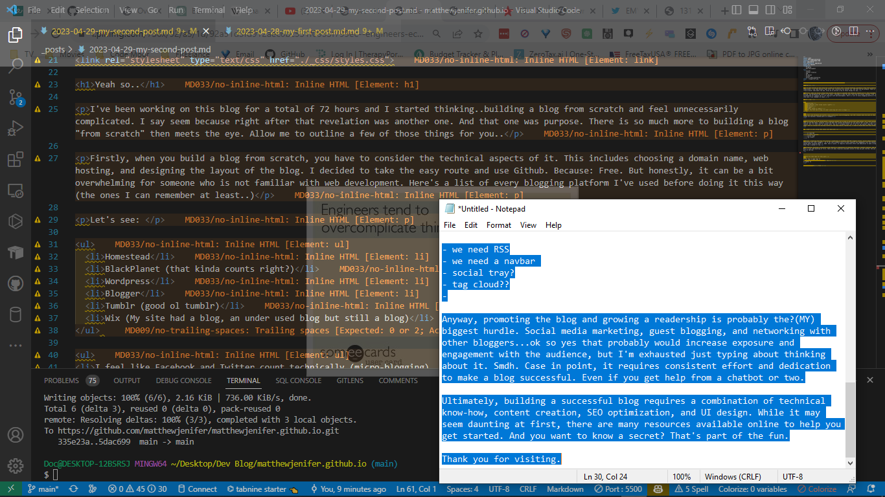

<link rel="stylesheet" type="text/css" href="./_css/styles.css">

<h1>Yeah so..</h1>

I've been working on this blog for a total of 72 hours and I started thinking..building a blog from scratch and feel unnecessarily complicated. I say seem because right after that revelation was another one. And that one was purpose. There is so much more to building a blog "from scratch" then meets the eye. Allow me to outline a few of those things for you..

Firstly, when you build a blog from scratch, you have to consider the technical aspects of it. This includes choosing a domain name, web hosting, and designing the layout of the blog. I decided to take the easy route and use Github. Because: Free. But honestly, it can be a bit overwhelming for someone who is not familiar with web development.

Here's a list of every blogging platform I've used before doing it this way (the ones I can remember at least..)

Let's see: 

<ul>
  <li>Homestead</li>
  <li>BlackPlanet (that kinda counts right?)</li>
  <li>Wordpress</li>
  <li>Blogger</li>
  <li>Tumblr (good ol tumblr)</li>
  <li>Wix (My site had a blog, an under used blog but still a blog)</li>
</ul> 

<ul>
<li>I feel like Facebook and Twitter count technically (micro-blogging), but tbh I havent done too much of that in years unless you count my random non business related posts on Linkedin</li>
</ul>

Which brings me to my second point: creating content for a blog is not an easy task either. It's time consuming. It takes time and effort to come up with the ideas, research, write and edit the content.Fortunately for you and me "AI" is here. I put it in quotes for a multitude of reasons, but I'll save that for another post. One you'll probably never see if not for yet another important aspect: search engine optimization (SEO). This is crucial for driving traffic to the blog (which, reminds me.. I need to build RSS into this thing... 

..might as well bring that check list back out:

- [ ] we need RSS
- [ ] we need a navbar 
- [ ] social tray?
- [ ] tag cloud??
- [ ] ...

Anyway, promoting the blog and growing a readership is probably the?(MY) biggest hurdle. Social media marketing, guest blogging, and networking with other bloggers...ok so yes that probably would increase exposure and engagement with the audience, but I'm exhausted just typing about thinking about it. Smdh. Case in point, it requires consistent effort and dedication to make a blog successful. Even if you get help from a chatbot or two.

Ultimately, building a successful blog requires a combination of technical know-how, content creation, SEO optimization, and UI design. While it may seem daunting at first, there are many resources available online to help you get started. And you want to know a secret? That's part of the fun.

Here are some tags for this post:

<ul>

  <li><a href="/tags/{{ tag }}/">{{ tag }}</a></li>

</ul>

<a href="/">Back to Home</a>

